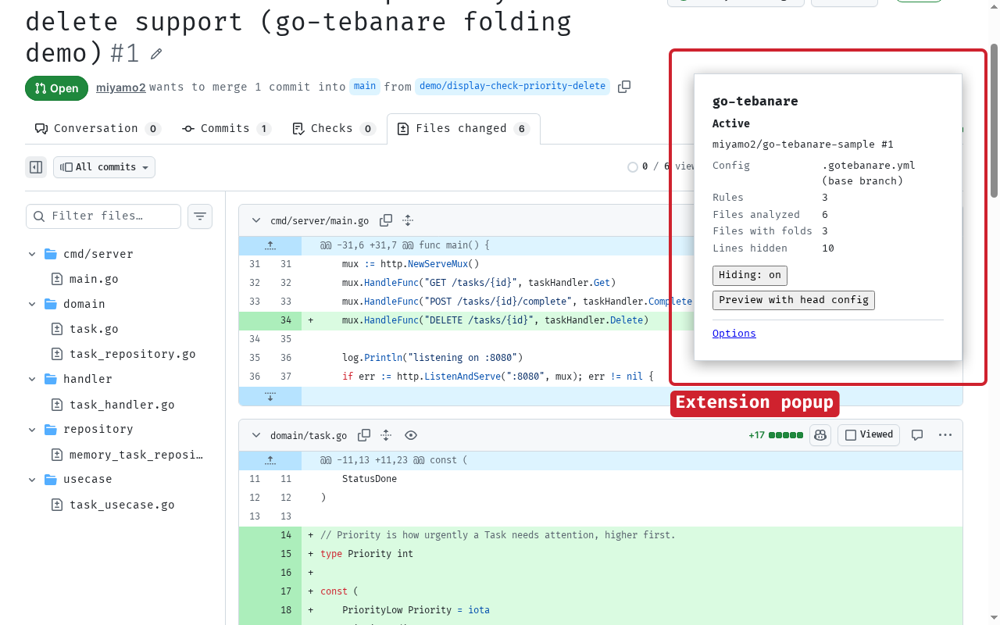
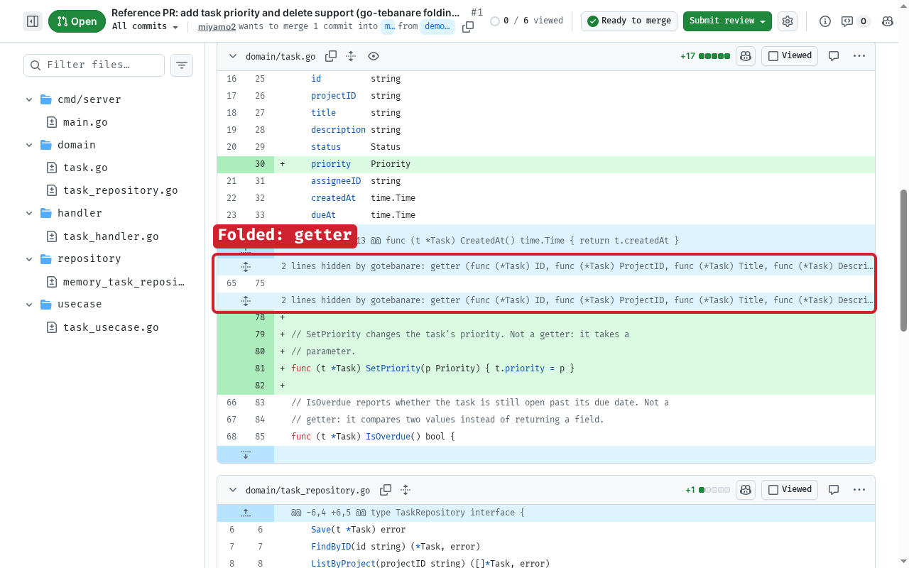
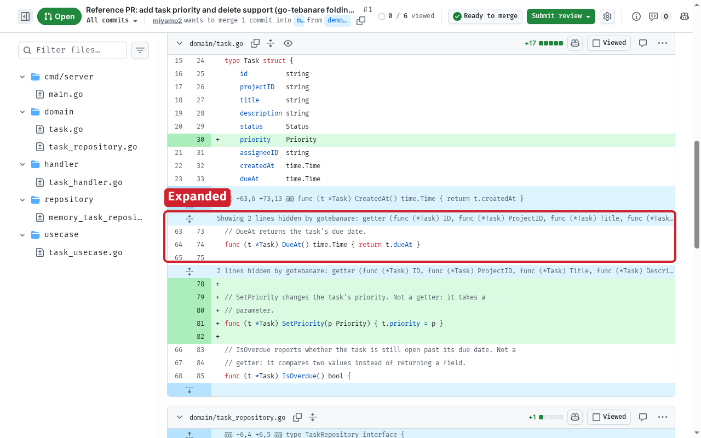
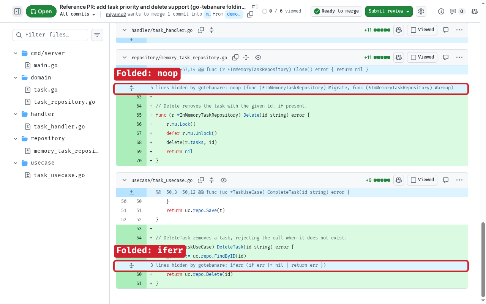

<div align="center">


"Tebanare" means "off one's hands" in Japanese. This tool takes more of the Go code review off your hands.

[](https://github.com/miyamo2/go-tebanare/actions/workflows/ci.yml)
[](https://pkg.go.dev/github.com/miyamo2/go-tebanare)
[](packages/chrome-extension)
[](LICENSE)

[Overview](#overview) • [Screenshots](#screenshots) • [Features](#features) • [Getting started](#getting-started) • [Configuration](#configuration) • [Usage](#usage) • [How it works](#how-it-works) • [Development](#development) • [Documentation](#documentation)

</div>

> [!IMPORTANT]
> go-tebanare is in early development. We plan to publish it on the Chrome Web Store. Until then, self-host it with the steps below.

## Overview

Reviewers skim getters, empty marker methods, and `if err != nil { return err }` blocks. go-tebanare hides this code in the **Files changed** tab of a pull request.

Your team lists the presets to apply in a `.gotebanare.yml` file in the repository. The engine, compiled to WebAssembly with TinyGo, parses each changed Go file with the standard `go/parser` and hides the code that the presets match:

```go
func (u *User) Name() string { return u.name }  // getter: hidden

func (*BadExpr) exprNode() {}                    // noop: hidden

if err != nil {                                  // iferr: hidden
	return nil, err
}

if err != nil {                                  // visible: it wraps the error
	return fmt.Errorf("load config: %w", err)
}
```

## Screenshots

<p align="center">
  
  <br>
  <sub>The popup reports what it hid for the tab, and lets you turn hiding off or preview the base branch's configuration.</sub>
</p>

<p align="center">
  
  <br>
  <sub>Matched getters collapse into a fold row that names the preset and the methods it matched.</sub>
</p>

<p align="center">
  
  <br>
  <sub>Click a fold row to show its lines again, and click it again to hide them.</sub>
</p>

<p align="center">
  
  <br>
  <sub>The <code>noop</code> and <code>iferr</code> presets fold alongside <code>getter</code> in the same pull request.</sub>
</p>

## Features

- Three presets, `getter`, `noop`, and `iferr`, with settings that widen or narrow each match.
- Code stays visible when the file fails to parse or when a match shares a line with other code. It also stays visible when a getter gains logic in the pull request.
- The extension reads `.gotebanare.yml` from the base branch, so a pull request cannot change its own rules. It fetches files with your GitHub session and contacts only github.com.
- You can show the lines of each fold, or turn hiding off for a tab from the popup or with <kbd>Alt</kbd>+<kbd>Shift</kbd>+<kbd>H</kbd>.

## Getting started

### Prerequisites

- Google Chrome 120 or later

### Self-host the extension

Download the latest release, rather than building it yourself:

1. On the [Releases](https://github.com/miyamo2/go-tebanare/releases) page, download `go-tebanare-chrome-extension-vX.Y.Z.zip` from the newest release and unzip it.
2. Open `chrome://extensions` and turn on **Developer mode**.
3. Click **Load unpacked** and select the unzipped folder.

### Build it yourself

Only needed for development, or to try a change that has not been released yet.

#### Prerequisites

- [Go](https://go.dev/dl/) 1.25 or later
- [TinyGo](https://tinygo.org/getting-started/install/) 0.42 or later
- [Bun](https://bun.sh/) 1.4 or later and [Node.js](https://nodejs.org/) 22

#### Steps

1. Clone the repository and build the WebAssembly engine:

   ```sh
   git clone https://github.com/miyamo2/go-tebanare.git
   cd go-tebanare
   make wasm
   ```

2. Install the dependencies and build the extension into `packages/chrome-extension/dist/`:

   ```sh
   bun install
   bun run --filter @go-tebanare/chrome-extension build
   ```

3. Open `chrome://extensions` and turn on **Developer mode**.
4. Click **Load unpacked** and select `packages/chrome-extension/dist/`.

## Configuration

Add `.gotebanare.yml` at the root of your repository and list the presets:

```yaml
version: 1
presets:
  - getter
  - noop
  - iferr
```

| Preset | Hides |
|---|---|
| `getter` | Methods that only return a field of the receiver, such as `func (u *User) Name() string { return u.name }`. |
| `noop` | Methods that take no parameters, return nothing, and have an empty body. |
| `iferr` | `if err != nil` blocks that return the error unchanged. |

Presets take settings, and `files` limits the files to analyze:

```yaml
version: 1
files:
  exclude: ["vendor/**", "third_party/**"]
presets:
  - getter:
      max_depth: 1            # u.name matches, u.cfg.timeout does not
  - noop:
      include_functions: true # also hide empty functions that are not methods
  - iferr:
      names: [err, "*Err"]    # also parseErr and similar names
```

> [!NOTE]
> The extension reads the configuration from the base branch of the pull request. A change to `.gotebanare.yml` applies after you merge it. Until then, you can preview the head branch configuration from the popup.

For completion and validation in your editor, point it at the [JSON Schema](schema/gotebanare.schema.json) of the configuration, for example with a first-line comment for [yaml-language-server](https://github.com/redhat-developer/yaml-language-server):

```yaml
# yaml-language-server: $schema=https://raw.githubusercontent.com/miyamo2/go-tebanare/main/schema/gotebanare.schema.json
```

With an invalid configuration, go-tebanare hides nothing and shows each error with its position in a banner above the diff. The [configuration reference](docs/configuration.md) covers the top-level keys and validation, and [presets](docs/presets.md) covers the criteria and settings of each preset.

## Usage

Open the **Files changed** tab of a pull request in a repository with a `.gotebanare.yml`. go-tebanare replaces matched code with fold rows.

- Click a fold row to show its lines, and click it again to hide them. The tooltip names the matching preset.
- Click the button in a file header to show or hide each fold row in that file.
- Open the popup to see the configuration in use and the count of hidden lines, turn hiding off for the tab, or preview the head branch configuration.
- Press <kbd>Alt</kbd>+<kbd>Shift</kbd>+<kbd>H</kbd> to turn hiding on or off. Change the shortcut in `chrome://extensions/shortcuts`.
- On the options page, list repositories to skip (`owner/name`, `owner/*`, or `*`), or turn on debug mode to outline matched code without hiding it.

## How it works

```
GitHub "Files changed" page
        │  content script reads the diff rows
        ▼
Chrome extension ── fetches .gotebanare.yml (base branch) and both versions of each file
        │
        ▼
@go-tebanare/engine (TypeScript wrapper) ── runs engine.wasm in the service worker
        │
        ▼
Go engine (TinyGo → WebAssembly) ── parses, applies presets, pairs old and new versions
        │  line ranges to hide
        ▼
Content script hides a row only when its text matches the analyzed source
```

The Go engine is also available as the Go package [`tebanare`](https://pkg.go.dev/github.com/miyamo2/go-tebanare). CI checks that the native and WebAssembly builds return identical results on the Go standard library, with the settings in [`testdata/parity/config.yml`](testdata/parity/config.yml). The [design overview](docs/design.md) covers the layers, the WebAssembly boundary, and how the engine reports failures.

## Development

| Command | Runs |
|---|---|
| `make test`, `make vet`, `make lint` | Go tests, `go vet`, and golangci-lint |
| `make wasm` | TinyGo build of `packages/engine/wasm/engine.wasm` |
| `make fuzz-smoke` | Each Go fuzz test for `FUZZTIME` (default 10s) |
| `make parity` | Comparison of the native and wasm results on the Go standard library |
| `bun run typecheck`, `bun run lint`, `bun run test` | TypeScript checks and unit tests of each package |
| `bun run --filter @go-tebanare/chrome-extension e2e` | Playwright end-to-end tests of the extension |

The [extension README](packages/chrome-extension/README.md) describes the end-to-end tests.

## Documentation

- [Configuration reference](docs/configuration.md): top-level keys, validation, hidden lines, and compatibility
- [Presets](docs/presets.md): criteria, settings, and examples of each preset
- [Design](docs/design.md): the layers and the engine boundary, plus how the engine reports failures
- [Architecture decision records](docs/adr/README.md): TinyGo, base-branch configuration, session fetches, syntax-only matching, and diff UI variants
